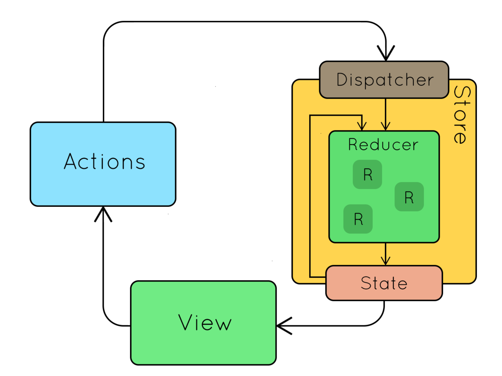
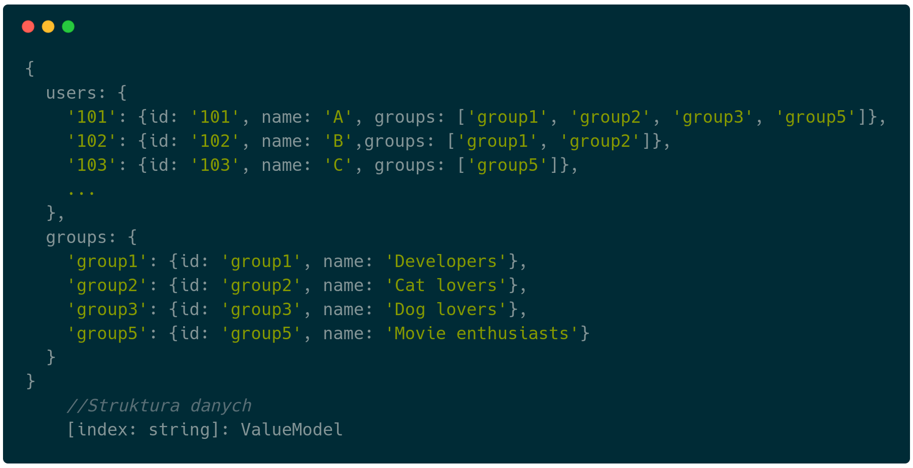
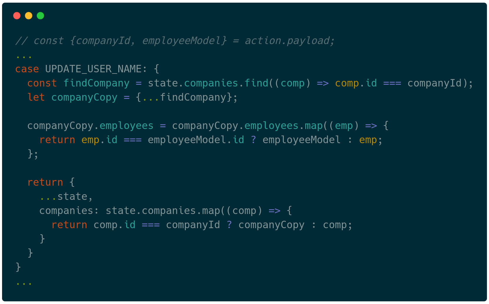
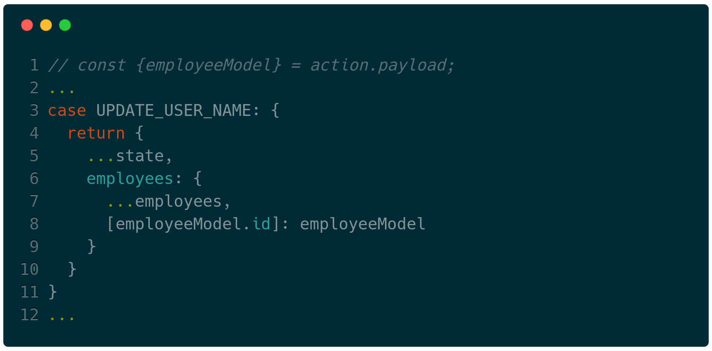
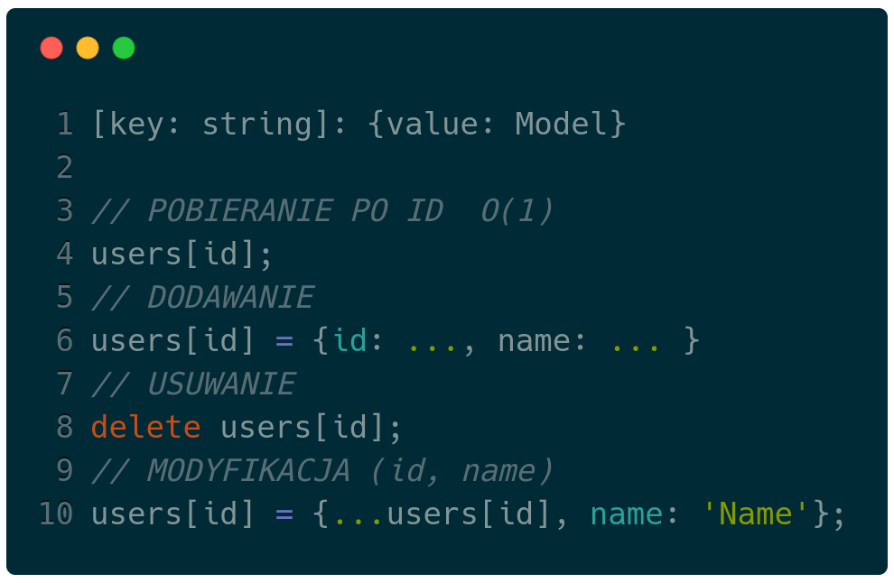

---?image=assets/image/first.jpg
### <span class="white">Redux state management</span>
---

## Stan aplikacji
```javascript
    global.state = {};
```
---
### Plan prezentacji
- Stan aplikacji |
- Modelowanie/Porządkowanie |
- Normalizacja |
- Postać normalna |
- @ngrx/entity |
---
## Stan aplikacji

- Jest globalnym obiektem |
- Przepływ danych jasno określony (jednokierunkowy) |
- Reducery zapisują dane do stanu |
- Selektory pobierają dane ze stanu |
---

--- 
## Typy danych
- Backend API |
- Dane aplikacji |
- Przykład: Informacje o wybranej zakładce, informacje o danych routingu, paginacji | 
- Zachowanie aplikacji: Stan załadowania danych - loading/loaded, Wybrany element |
---
(OBRAZEK) ZAŁADOWANE DANE I PRZYKŁADOWY STAN (NESTED OBJECTS, NOT CATEGORIZED)
---
## Uporządkowanie stanu
- Grupowanie danych tego samego rodzaju |
- Ustanowienie relacji pomiędzy nimi |
- Usunięcie duplikacji |
- Normalizacja |
---
## Postać znormalizowana
- 1 postać normalna | 
- 2 posać normalna | 
- 3 postać normalna |
- 4, 5 (tylko w rozważaniach teoretycznych) |
---
## 1 postać normalna
(OPIS + PRZYKŁAD)
---
## 2 postać normalna
(OPIS + PRZYKŁAD)
---
## 3 postać normalna
(OPIS + PRZYKŁAD)
---
### Praktyczne zastosowanie ma postać 2
---

--- 

---
## Dlaczego znormalizowane
- Pozbywamy się duplikatów! |
- Pozbywamy się zagnieżdżonych struktur! |
---
## Zduplikowane dane 
- Zwiększanie zużycia pamięci |
- Zduplikowane dane === problemy z modyfikacją |
- Musimy pamiętać o aktualizacji wszystkich miejsca duplikacji na raz... |
---

---
## Zagnieżdzone dane
- Nadmiarowe odświeżanie widoków | 
- Niepotrzebna złożoność |
- Zniszczenie aktualnego stanu (immutability, predictability) |
---

---

---
<p><span class="slide-title">Stan znormalizowany</span></p>

---
<p><span class="slide-title">@Normalizr</span></p>

```
//INPUT
{
  "id": "123",
  "author": {
    "id": "1",
    "name": "Paul"
  },
  "title": "My awesome blog post",
  "comments": [
    {
      "id": "324",
      "commenter": {
        "id": "2",
        "name": "Nicole"
      }
    }
  ]
}
// SCHEMAS
import { normalize, schema } from 'normalizr';

// Define a users schema
const user = new schema.Entity('users');

// Define your comments schema
const comment = new schema.Entity('comments', {
  commenter: user
});

// Define your article
const article = new schema.Entity('articles', {
  author: user,
  comments: [comment]
});

const normalizedData = normalize(originalData, article);

//OUTPUT
{
  result: "123",
  entities: {
    "articles": {
      "123": {
        id: "123",
        author: "1",
        title: "My awesome blog post",
        comments: [ "324" ]
      }
    },
    "users": {
      "1": { "id": "1", "name": "Paul" },
      "2": { "id": "2", "name": "Nicole" }
    },
    "comments": {
      "324": { id: "324", "commenter": "2" }
    }
  }
}
```
@[1-19](Przed normalizacją.)
@[20-38](Definiowanie schematów.)
@[39-58](Wynik normalizacji.)
---
<p><span class="slide-title">Operacje na tablicy</span></p>

---
<p><span class="slide-title">Operacje na indeksowanym zbiorze</span></p>

---

---
## ADAPTER
Udostępnia metody do zarządzania pojedynczą koleckcją (tablicą) danych określonego typu.
---
## W PRAKTYCE
- addOne, addMany, updateOne, deleteOne, deleteAll |
- Automatyczni generuje podstawowe selektory |
- Generuje strukture indeksowaną z podanej tablicy |
- Możemy od razu pobrać 'initialState' |
---
## Jak to działa
---
## Model danych
```typescript
interface Book {
  id: string;
  title: string;
}
```
---
## 1. Adapter
Pierwszym krokiem jest utworznie adaptera dla modelu danych.

```typescript
import { createEntityAdapter } from '@ngrx/entity';
const bookAdapter = createEntityAdapter<Book>();
```
---
## 2. Interface extends EntityState
Musimy zdeklarować interfejs.
```typescript
import { EntityState } from '@ngrx/entity';
export interface BookState extends EntityState<Book> { }
```
Który pod spodem wygląda tak:
```typescript
interface EntityState<V> {
  ids: string[];
  entities: { [id: string]: V };
}
```
---
## 4. Reducer
---
```typescript
const initialState: BookState = bookAdapter.getInitialState();
export function reducer(
  state: BookState = initialState,
  action: BookActions,
): BookState {
  switch (action.type) {
    case BookActionTypes.ADD_ONE:
      return bookAdapter.addOne(action.book, state);
    case BookActionTypes.UPDATE_ONE:
      return bookAdapter.updateOne({
        id: action.id,
        changes: action.changes,
      }, state);
    case BookActionTypes.DELETE_ONE:
      return bookAdapter.deleteOne(action.id, state);
    case BookActionTypes.GET_ALL:
      return bookAdapter.addAll(action.books, state);
    default:
      return state;
  }
}
```
@[1](initialState pobieramy z adaptera)
@[7-8](Operacja dodania jednej encji.)
@[9-13](Modyfikacja encji o podanym id.)
@[14-15](Usunięcie jednego elementu.)
@[16-17](Zapis całej kolekcji.)
---
## 5. Selectors
Ostatnią rzeczą jaką musimy zrobić jest pobranie selektorów
```typescript
export const {
  selectIds: getBookIds,
  selectEntities: getBooks,
  selectAll: getAllBooks,
  selectTotal: getBooksTotal,
} = bookAdapter.getSelectors();
```
---
## Pytania

---